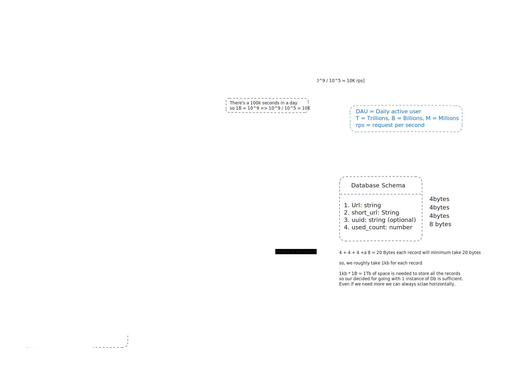

# URL Shortener Service

A scalable, production-ready URL shortener inspired by Bitly. This project is designed for high throughput, analytics, and reliability, using Node.js, Express, MongoDB, and Redis (with separate Redis services for URL caching and analytics).

---

## System Design



---

## Features
- **Shorten URLs:** Converts long URLs into short, unique 6-character codes.
- **Redirection:** Redirects users from short URLs to the original long URLs.
- **Analytics:** Tracks the number of times each short URL is accessed, using an in-memory Redis analytics service and periodic DB flush.
- **High Scalability:** Designed to handle up to 10,000 requests per second and billions of URLs.
- **Health Checks & Logging:** Health endpoint and structured logging with Winston.

---

## Functional Requirements
- Shorten a long URL to a 6 or 7 character code
- Redirect users to the correct URL when using the short URL
- Track analytics (number of times a short URL is viewed)

## Non-Functional Requirements
- Minimize redirect latency
- Support 100M daily active users (DAU)
- Handle 1B read requests/day (~10k RPS)
- Handle 1M write requests/day
- Store 1M to 5M total lifetime URLs

---

## API Endpoints

### Create Short URL
- **POST** `/api/url/create`
  - **Body:** `{ "url": "https://example.com/test/urls" }`
  - **Response:** `{ "short_url": "abc123" }`

### Redirect to Long URL
- **GET** `/api/url/:shortUrl`
  - **Response:** HTTP 302 redirect to the original URL

### Health Check
- **GET** `/health`
  - **Response:** `{ "status": "ok" }`

---

## Tech Stack
- **Node.js** + **Express**
- **MongoDB** (Mongoose)
- **Redis** (separate instances for URL cache and analytics)
- **Winston** (logging)
- **node-cron** (for scheduled analytics flush)

---

## Running the Project

### 1. Install Dependencies
```zsh
npm install
```

### 2. Start MongoDB
Make sure MongoDB is running locally or update your `.env` with your MongoDB URI.

### 3. Start Redis Services
See [`redis-instruction.md`](redis-instruction.md) for details.
```zsh
# Start URL Redis-Service (default port 6379)
redis-server --port 6379
# Start Analytics Redis-Service (port 6380)
redis-server --port 6380
```

### 4. Set Environment Variables
Create a `.env` file:
```
PORT=8080
MONGO_URI=mongodb://localhost:27017/urlshortener
REDIS_URL_CACHE=redis://localhost:6379
REDIS_URL_ANALYTICS=redis://localhost:6380
```

### 5. Start the Server
```zsh
npm run dev
```

### 6. (Optional) Run Analytics Flush Job via Cron
You can run the analytics flush job as a cron job or with node-cron in the server. Example for macOS:
```zsh
*/5 * * * * cd /Users/rohit/dev/System-design-primer/url-shortner && node jobs/flushtodb.js >> logs/combined.log 2>&1
```

---

## Folder Structure
```
config/           # Redis configs, logger
controllers/      # Express controllers
services/         # Business logic (URL, analytics)
jobs/             # Standalone jobs (analytics flush)
models/           # Mongoose models
routes/           # Express routes
middleware/       # Custom middleware (logging)
design/           # System design diagrams
logs/             # Winston log files
```

---

## System Design Notes
- **URL Cache:** Redis instance for fast lookups, reducing DB load.
- **Analytics:** Separate Redis instance for in-memory analytics, periodically flushed to MongoDB.
- **Scalability:** Designed for horizontal scaling (stateless app, scalable DB, scalable Redis).
- **Short URL Generation:** Uses SHA-256 hash and collision checking for unique codes.

---

